## About Me

Software Engineer @ Prima | MSc in Artificial Intelligence and Robotics @ Sapienza University of Rome

## Highlighted Projects

## All My Repositories

  
Repositories on My GitHub

  &nbsp;

  
  

  
  

  
  

  
  

  
  

  

---

      
  
Repositories on Collaborators' GitHubs

  &nbsp;

  
  

  
  

  
  

  

## Contacts

<!--
**MatteoPannacci/MatteoPannacci** is a ✨ _special_ ✨ repository because its `README.md` (this file) appears on your GitHub profile.

Here are some ideas to get you started:

- 🔭 I’m currently working on ...
- 🌱 I’m currently learning ...
- 👯 I’m looking to collaborate on ...
- 🤔 I’m looking for help with ...
- 💬 Ask me about ...
- 📫 How to reach me: ...
- 😄 Pronouns: ...
- ⚡ Fun fact: ...
-->
